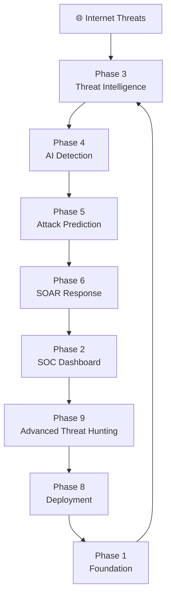

# 🛡️⚡ AI-CYBER-THREAT-INTELLIGENCE-SYSTEM ⚡🛡️

<div align="center">

# 🤖 NEURAL CYBER DEFENSE PLATFORM

```
██████╗ ██╗   ██╗██████╗ ███████╗██████╗ 
██╔══██╗╚██╗ ██╔╝██╔══██╗██╔════╝██╔══██╗
██████╔╝ ╚████╔╝ ██████╔╝█████╗  ██████╔╝
██╔═══╝   ╚██╔╝  ██╔══██╗██╔══╝  ██╔══██╗
██║        ██║   ██║  ██║███████╗██║  ██║
╚═╝        ╚═╝   ╚═╝  ╚═╝╚══════╝╚═╝  ╚═╝
```

### 🚨 AI POWERED AUTONOMOUS SECURITY OPERATIONS CENTER 🚨

```
[ SYSTEM BOOTING................. ]

[ LOADING THREAT INTELLIGENCE.... ]

[ ACTIVATING AI ENGINE............ ]

[ INITIALIZING DEFENSE CORE....... ]

[ SOC PLATFORM STATUS : ONLINE 🟢 ]

```

</div>

---

# 🌌 PROJECT OVERVIEW

**AI-Cyber-Threat-Intelligence-System** is an advanced AI-powered cybersecurity platform designed to work as an intelligent Security Operations Center (SOC).

The system combines:

```
🧠 Artificial Intelligence
🔍 Threat Intelligence
📊 SOC Monitoring
🕸️ Attack Path Prediction
⚡ Automated Response
🎯 Advanced Threat Hunting
```

into one unified cyber defense ecosystem.

---

# 🧬 CORE MISSION

```
                CYBER ATTACK

                     ↓

              🔍 DETECT THREAT

                     ↓

              🧠 ANALYZE DATA

                     ↓

              🎯 PREDICT ATTACK

                     ↓

              ⚡ AUTOMATE RESPONSE

                     ↓

              🤖 AI LEARNING

                     ↓

              🛡️ DEFEND SYSTEM

```

---

# 🏢 ENTERPRISE SOC ARCHITECTURE



---

# 📂 PHASE ECOSYSTEM

# 🏗️ PHASE 1 — PROJECT FOUNDATION

Folder:

```
Phase-1_Project-Foundation
```

Role:

```
SYSTEM CORE ENGINE
```

Functions:

```
✓ Backend Foundation
✓ Database Architecture
✓ Configuration System
✓ Core Services
✓ Application Structure
```

Output:

```
Stable Cybersecurity Platform Base
```

---

# 📊 PHASE 2 — SOC DASHBOARD DEVELOPMENT

Folder:

```
Phase-2_SOC-Dashboard-Development
```

Role:

```
SECURITY COMMAND CENTER
```

Functions:

```
✓ Real-Time Monitoring
✓ Threat Visualization
✓ Alert Management
✓ Risk Dashboard
✓ Security Analytics
```

Output:

```
SOC Analyst Monitoring Interface
```

---

# 🌍 PHASE 3 — THREAT INTELLIGENCE ENGINE

Folder:

```
Phase-3_Threat-Intelligence-Engine
```

Role:

```
GLOBAL THREAT KNOWLEDGE SYSTEM
```

Functions:

```
✓ IOC Processing
✓ Threat Data Collection
✓ Malware Intelligence
✓ Threat Correlation
✓ Security Information Analysis
```

Output:

```
Threat Intelligence Database
```

---

# 🧠 PHASE 4 — AI THREAT DETECTION ENGINE

Folder:

```
Phase-4_AI-Threat-Detection-Engine
```

Role:

```
AI SECURITY BRAIN
```

Functions:

```
✓ Anomaly Detection
✓ Behaviour Analysis
✓ Threat Classification
✓ Risk Calculation
✓ AI Decision Making
```

Example:

```
Suspicious Login Pattern

        ↓

AI Analysis

        ↓

High Risk Attack Detected 🚨
```

---

# 🕸️ PHASE 5 — ATTACK PATH PREDICTION

Folder:

```
Phase-5_Attack-Path-Prediction
```

Role:

```
FUTURE ATTACK SIMULATION ENGINE
```

Functions:

```
✓ Attack Graph
✓ Path Prediction
✓ Vulnerability Impact
✓ Risk Forecast
```

Example:

```
Attacker

 ↓

User Account

 ↓

Application Server

 ↓

Database

```

---

# ⚡ PHASE 6 — SOAR AUTOMATED RESPONSE

Folder:

```
Phase-6_SOAR-Automated-Response
```

Role:

```
AUTONOMOUS DEFENSE SYSTEM
```

Functions:

```
✓ Incident Creation
✓ Automated Workflow
✓ Threat Blocking
✓ SOC Notification
```

Example:

```
Threat Found

      ↓

Automatic Response

      ↓

Incident Controlled
```

---

# 🌐 PHASE 7 — THREAT INTELLIGENCE INTEGRATION

Folder:

```
Phase-7_Threat-Intelligence-and-External-Integrations
```

Role:

```
GLOBAL SECURITY CONNECTION
```

Functions:

```
✓ External Threat Feeds
✓ CVE Intelligence
✓ Reputation Analysis
✓ Data Enrichment
```

---

# 🚀 PHASE 8 — DEPLOYMENT

Folder:

```
phase-8-deployment
```

Role:

```
PRODUCTION OPERATIONS
```

Functions:

```
✓ Docker Deployment
✓ Environment Setup
✓ Monitoring
✓ Health Checks
✓ Production Configuration
```

---

# 🎯 PHASE 9 — ADVANCED AI THREAT HUNTING

Folder:

```
Phase-9_Advanced-AI-Threat-Hunting
```

Role:

```
PROACTIVE AI SECURITY HUNTER
```

Functions:

```
✓ IOC Hunting
✓ Attack Pattern Discovery
✓ AI Learning
✓ Threat Correlation
✓ Continuous Improvement
```

---

# 🔥 REAL-TIME ATTACK SIMULATION

```
TIME 00:00

🚨 Suspicious Activity Detected


        ↓


TIME 00:01

🔍 Threat Intelligence Collects Data


        ↓


TIME 00:02

🧠 AI Detects Attack Pattern


        ↓


TIME 00:03

🎯 Prediction Engine Calculates Risk


        ↓


TIME 00:04

⚡ SOAR Executes Defense


        ↓


TIME 00:05

📊 SOC Dashboard Updates


        ↓


TIME 00:06

🤖 AI Learns New Pattern

```

---

# 🧠 AI SELF-LEARNING LOOP

```
              NEW THREAT

                  ↓

             DATA ANALYSIS

                  ↓

             AI DECISION

                  ↓

             RESPONSE

                  ↓

             FEEDBACK

                  ↓

             MODEL IMPROVEMENT

                  ↓

             STRONGER DEFENSE

```

---

# 🔗 FINAL INTEGRATED FLOW

```
Phase 1
  |
  ↓
Foundation Core

  |
  ↓

Phase 3
Threat Intelligence

  |
  ↓

Phase 4
AI Detection

  |
  ↓

Phase 5
Attack Prediction

  |
  ↓

Phase 6
SOAR Response

  |
  ↓

Phase 2
SOC Dashboard

  |
  ↓

Phase 9
AI Threat Hunting

  |
  ↓

Phase 8
Deployment

```

---

# 🛠️ TECHNOLOGY STACK

## Backend

```
🐍 Python
⚡ FastAPI
```

## Frontend

```
⚛️ React
⚡ Vite
```

## Database

```
🐘 PostgreSQL
```

## AI

```
🧠 Machine Learning
📊 Behaviour Analysis
🎯 Prediction Models
```

## Deployment

```
🐳 Docker
☁️ Cloud Ready Architecture
```

---

# 🏆 FINAL SYSTEM CAPABILITIES

```
✅ AI Threat Detection

✅ Real-Time SOC Monitoring

✅ Attack Prediction

✅ Automated Response

✅ Threat Intelligence

✅ Advanced Threat Hunting

✅ Security Analytics

✅ Continuous AI Improvement

```

---

# 🛡️ SYSTEM IDENTITY

```
╔════════════════════════════════╗
║                                ║
║   AI DEFENSE CORE : ONLINE 🟢  ║
║                                ║
║   THREAT ENGINE : ACTIVE 🔥    ║
║                                ║
║   SOC MONITOR : RUNNING 📊     ║
║                                ║
║   RESPONSE SYSTEM : READY ⚡   ║
║                                ║
╚════════════════════════════════╝
```

---

# 🚀 PROJECT VISION

> "Building an intelligent cybersecurity platform capable of detecting threats, predicting attacks, automating defense, and continuously learning from cyber events."

```
        🔍 DETECT

             ↓

        🧠 ANALYZE

             ↓

        🎯 PREDICT

             ↓

        ⚡ RESPOND

             ↓

        🤖 LEARN

             ↓

        🛡️ DEFEND

```

# END OF AI-CYBER-THREAT-INTELLIGENCE-SYSTEM
