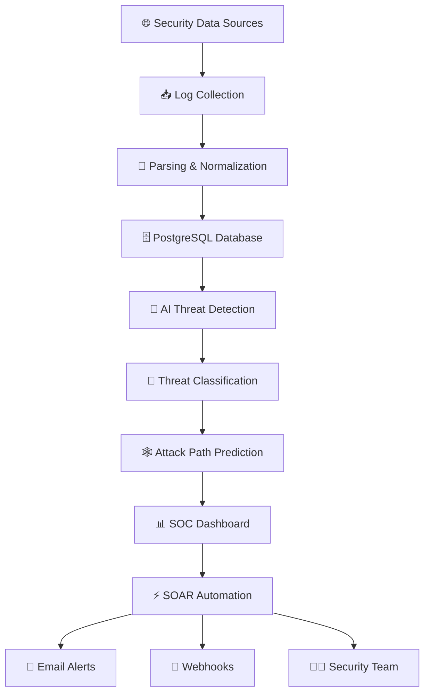
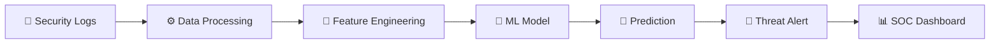
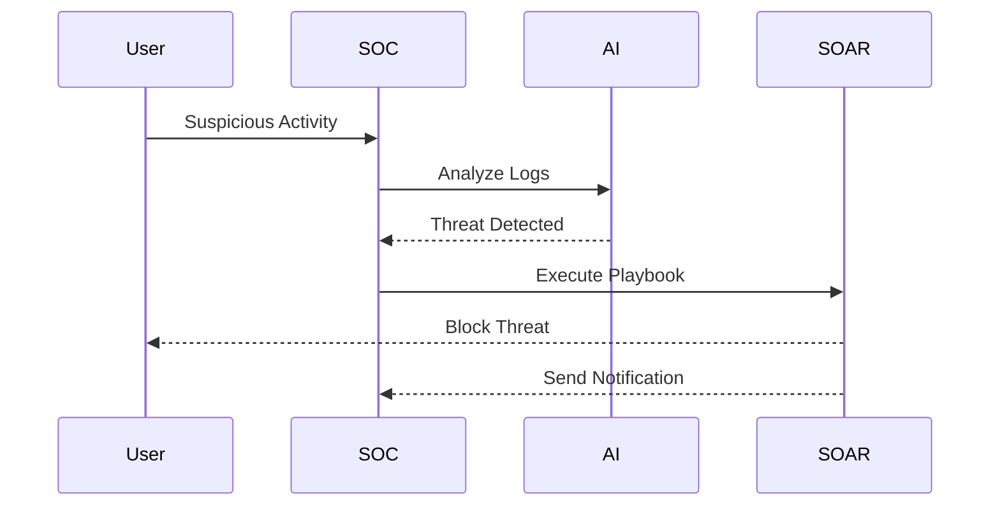

# 🛡️ AI Cyber Threat Intelligence System

<p align="center">
  
</p>

<p align="center">
  
  
  
  
  
  
  
</p>

---

## 📖 Overview

AI Cyber Threat Intelligence System is an AI-powered Security Operations Center (SOC) platform that collects security logs, detects cyber threats using Machine Learning, predicts attack paths, and automates incident response through SOAR workflows.

---

## 🏗️ System Architecture



---

## 🤖 AI Detection Pipeline



---

## ⚡ Incident Response Workflow



---

## 🚀 Development Phases

### 🏗️ Phase 1 — Project Foundation
- React + Vite frontend
- FastAPI backend
- PostgreSQL setup
- Docker environment
- Project documentation

### 📊 Phase 2 — SOC Dashboard
- Security overview
- Alert monitoring
- Risk charts
- Asset monitoring
- Reports

### 📥 Phase 3 — Log Management
- Log ingestion
- Parsing
- Normalization
- Event storage
- Analysis pipeline

### 🤖 Phase 4 — AI Threat Detection
- Anomaly detection
- Threat classification
- Risk prediction
- User behavior analysis

### 🕸️ Phase 5 — Attack Prediction
- Attack graph generation
- Asset relationship mapping
- Vulnerability analysis
- Security recommendations

### ⚡ Phase 6 — SOAR Automation
- Incident management
- Playbook engine
- Automated response
- Email & webhook notifications

---

## 🛠️ Technology Stack

| Layer | Technologies |
|------|---------------|
| Frontend | React, Vite |
| Backend | Python, FastAPI |
| Database | PostgreSQL |
| AI/ML | Scikit-learn, Pandas, NumPy |
| Visualization | Chart.js / Recharts |
| Security | JWT Authentication |
| DevOps | Docker |

---

## 📁 Project Structure

```text
AI-Cyber-Threat-Intelligence-System
│
├── frontend
├── backend
├── ai-engine
├── dashboard
├── log-management
├── attack-prediction
├── soar
├── database
├── docker
├── docs
├── tests
└── README.md
```

---

## 🌟 Future Enhancements

- 🌐 Real-time threat intelligence feeds
- ☁️ Cloud security monitoring
- 🤖 Deep learning models
- 📱 Mobile SOC dashboard
- 🛰️ MITRE ATT&CK mapping
- 🔥 Predictive threat analytics

---

## ⭐ Support

If you like this project, give it a ⭐ on GitHub!

<p align="center">
  <b>🛡️ Predict • Detect • Respond • Secure 🚀</b>
</p>
