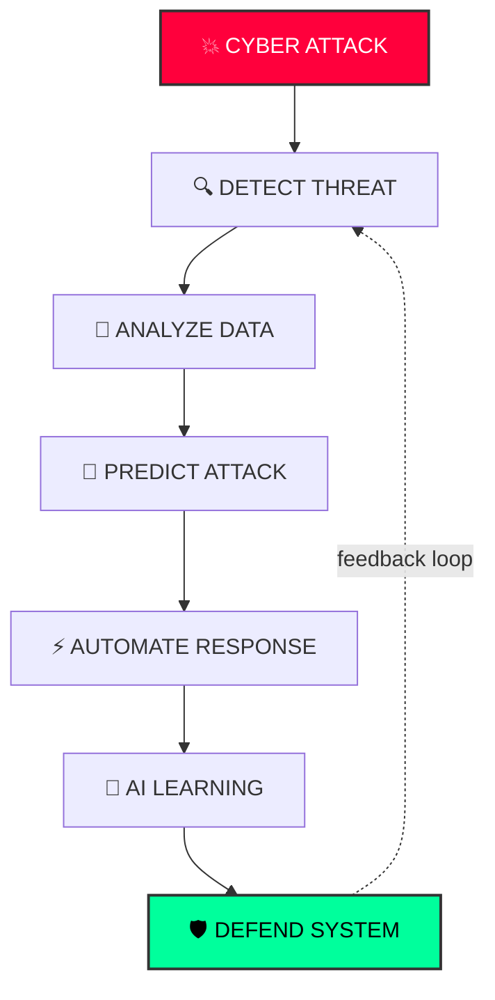
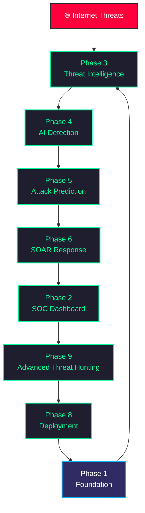
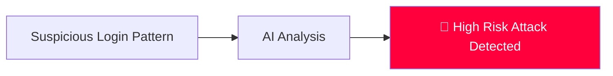
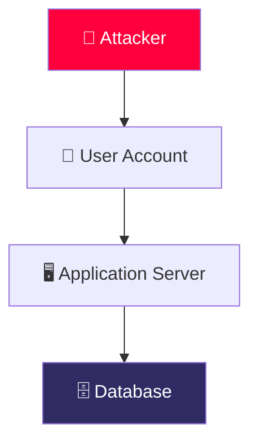
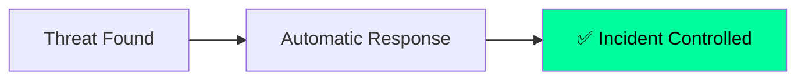
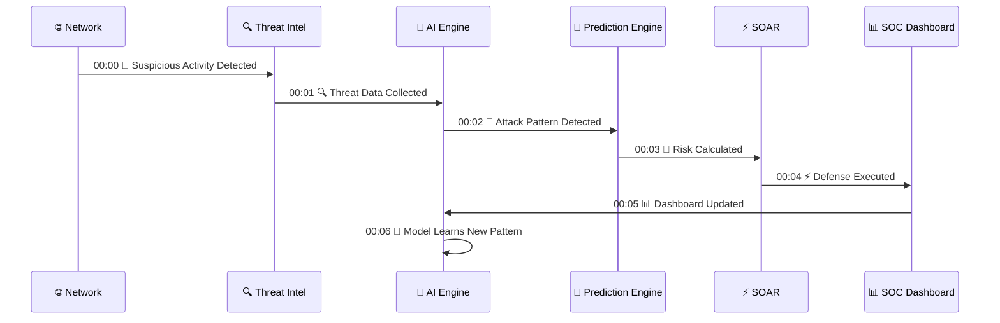
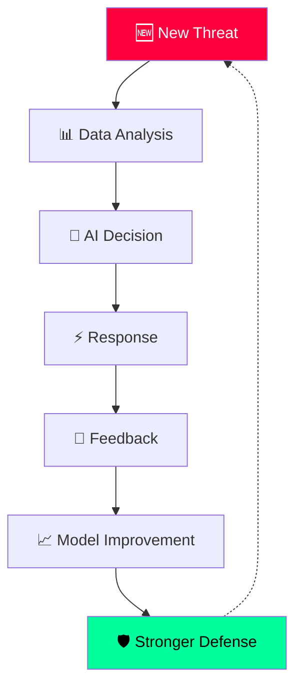
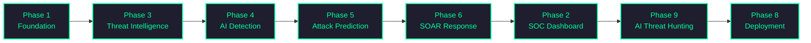
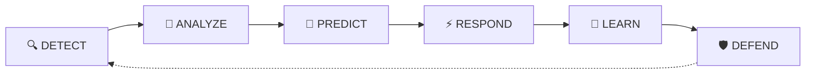

<div align="center">


<br/>

<a href="#">
  
</a>

<br/><br/>


<br/>


</div>

---

<div align="center">

```
[ SYSTEM BOOTING........................... 100% ]
[ LOADING THREAT INTELLIGENCE.............. 100% ]
[ ACTIVATING AI ENGINE...................... 100% ]
[ INITIALIZING DEFENSE CORE................ 100% ]
[ SOC PLATFORM STATUS : ████████████ ONLINE 🟢 ]
```

</div>

---

## 📑 Table of Contents

- [🌌 Project Overview](#-project-overview)
- [🧬 Core Mission](#-core-mission)
- [🏢 Enterprise SOC Architecture](#-enterprise-soc-architecture)
- [📂 Phase Ecosystem](#-phase-ecosystem)
- [🔥 Real-Time Attack Simulation](#-real-time-attack-simulation)
- [🧠 AI Self-Learning Loop](#-ai-self-learning-loop)
- [🛠️ Technology Stack](#️-technology-stack)
- [⚙️ Quick Start](#️-quick-start)
- [🏆 System Capabilities](#-final-system-capabilities)
- [🛡️ System Identity](#️-system-identity)
- [🚀 Project Vision](#-project-vision)

---

## 🌌 Project Overview

**AI-Cyber-Threat-Intelligence-System** एउटा advanced AI-powered cybersecurity platform हो, जुन एउटा intelligent **Security Operations Center (SOC)** को रूपमा काम गर्न design गरिएको छ।

यो system ले निम्न कुराहरूलाई एउटै unified cyber defense ecosystem मा combine गर्छ:

| Module | Description |
|---|---|
| 🧠 Artificial Intelligence | Behaviour-based anomaly & threat detection |
| 🔍 Threat Intelligence | Global IOC & CVE correlation engine |
| 📊 SOC Monitoring | Real-time dashboard & alerting |
| 🕸️ Attack Path Prediction | Graph-based future attack simulation |
| ⚡ Automated Response (SOAR) | Autonomous incident containment |
| 🎯 Advanced Threat Hunting | Continuous proactive AI hunting |

---

## 🧬 Core Mission



---

## 🏢 Enterprise SOC Architecture



---

## 📂 Phase Ecosystem

<details open>
<summary><b>🏗️ PHASE 1 — Project Foundation</b></summary>

<br/>

**Folder:** `Phase-1_Project-Foundation`
**Role:** `SYSTEM CORE ENGINE`

- ✅ Backend Foundation
- ✅ Database Architecture
- ✅ Configuration System
- ✅ Core Services
- ✅ Application Structure

**Output:** `Stable Cybersecurity Platform Base`

</details>

<details>
<summary><b>📊 PHASE 2 — SOC Dashboard Development</b></summary>

<br/>

**Folder:** `Phase-2_SOC-Dashboard-Development`
**Role:** `SECURITY COMMAND CENTER`

- ✅ Real-Time Monitoring
- ✅ Threat Visualization
- ✅ Alert Management
- ✅ Risk Dashboard
- ✅ Security Analytics

**Output:** `SOC Analyst Monitoring Interface`

</details>

<details>
<summary><b>🌍 PHASE 3 — Threat Intelligence Engine</b></summary>

<br/>

**Folder:** `Phase-3_Threat-Intelligence-Engine`
**Role:** `GLOBAL THREAT KNOWLEDGE SYSTEM`

- ✅ IOC Processing
- ✅ Threat Data Collection
- ✅ Malware Intelligence
- ✅ Threat Correlation
- ✅ Security Information Analysis

**Output:** `Threat Intelligence Database`

</details>

<details>
<summary><b>🧠 PHASE 4 — AI Threat Detection Engine</b></summary>

<br/>

**Folder:** `Phase-4_AI-Threat-Detection-Engine`
**Role:** `AI SECURITY BRAIN`

- ✅ Anomaly Detection
- ✅ Behaviour Analysis
- ✅ Threat Classification
- ✅ Risk Calculation
- ✅ AI Decision Making



</details>

<details>
<summary><b>🕸️ PHASE 5 — Attack Path Prediction</b></summary>

<br/>

**Folder:** `Phase-5_Attack-Path-Prediction`
**Role:** `FUTURE ATTACK SIMULATION ENGINE`

- ✅ Attack Graph
- ✅ Path Prediction
- ✅ Vulnerability Impact
- ✅ Risk Forecast



</details>

<details>
<summary><b>⚡ PHASE 6 — SOAR Automated Response</b></summary>

<br/>

**Folder:** `Phase-6_SOAR-Automated-Response`
**Role:** `AUTONOMOUS DEFENSE SYSTEM`

- ✅ Incident Creation
- ✅ Automated Workflow
- ✅ Threat Blocking
- ✅ SOC Notification



</details>

<details>
<summary><b>🌐 PHASE 7 — Threat Intelligence Integration</b></summary>

<br/>

**Folder:** `Phase-7_Threat-Intelligence-and-External-Integrations`
**Role:** `GLOBAL SECURITY CONNECTION`

- ✅ External Threat Feeds
- ✅ CVE Intelligence
- ✅ Reputation Analysis
- ✅ Data Enrichment

</details>

<details>
<summary><b>🚀 PHASE 8 — Deployment</b></summary>

<br/>

**Folder:** `phase-8-deployment`
**Role:** `PRODUCTION OPERATIONS`

- ✅ Docker Deployment
- ✅ Environment Setup
- ✅ Monitoring
- ✅ Health Checks
- ✅ Production Configuration

</details>

<details>
<summary><b>🎯 PHASE 9 — Advanced AI Threat Hunting</b></summary>

<br/>

**Folder:** `Phase-9_Advanced-AI-Threat-Hunting`
**Role:** `PROACTIVE AI SECURITY HUNTER`

- ✅ IOC Hunting
- ✅ Attack Pattern Discovery
- ✅ AI Learning
- ✅ Threat Correlation
- ✅ Continuous Improvement

</details>

---

## 🔥 Real-Time Attack Simulation



---

## 🧠 AI Self-Learning Loop



---

## 🔗 Final Integrated Flow



---

## 🛠️ Technology Stack

<div align="center">

### Backend
 

### Frontend
 

### Database


### AI / ML
  

### Deployment
  

</div>

---

## ⚙️ Quick Start

```bash
# Clone the repository
git clone https://github.com/your-org/ai-cyber-threat-intelligence-system.git
cd ai-cyber-threat-intelligence-system

# Start with Docker Compose
docker-compose up --build

# Access the SOC Dashboard
# → http://localhost:3000

# Access the API
# → http://localhost:8000/docs
```

| Service | Port | Description |
|---|---|---|
| SOC Dashboard | `3000` | React frontend |
| Core API | `8000` | FastAPI backend |
| PostgreSQL | `5432` | Primary database |
| AI Engine | `internal` | ML inference service |

---

## 🏆 Final System Capabilities

- ✅ AI Threat Detection
- ✅ Real-Time SOC Monitoring
- ✅ Attack Prediction
- ✅ Automated Response (SOAR)
- ✅ Threat Intelligence Correlation
- ✅ Advanced Threat Hunting
- ✅ Security Analytics
- ✅ Continuous AI Improvement

---

## 🛡️ System Identity

<div align="center">

```
╔════════════════════════════════════╗
║                                      ║
║   AI DEFENSE CORE     : ONLINE  🟢  ║
║   THREAT ENGINE       : ACTIVE  🔥  ║
║   SOC MONITOR         : RUNNING 📊  ║
║   RESPONSE SYSTEM     : READY   ⚡  ║
║                                      ║
╚════════════════════════════════════╝
```

</div>

---

## 🚀 Project Vision

> *"Building an intelligent cybersecurity platform capable of detecting threats, predicting attacks, automating defense, and continuously learning from cyber events."*



---

<div align="center">

### ⭐ यदि यो project लाई useful लाग्यो भने, एउटा Star दिन नबिर्सनुहोस्!


</div>
