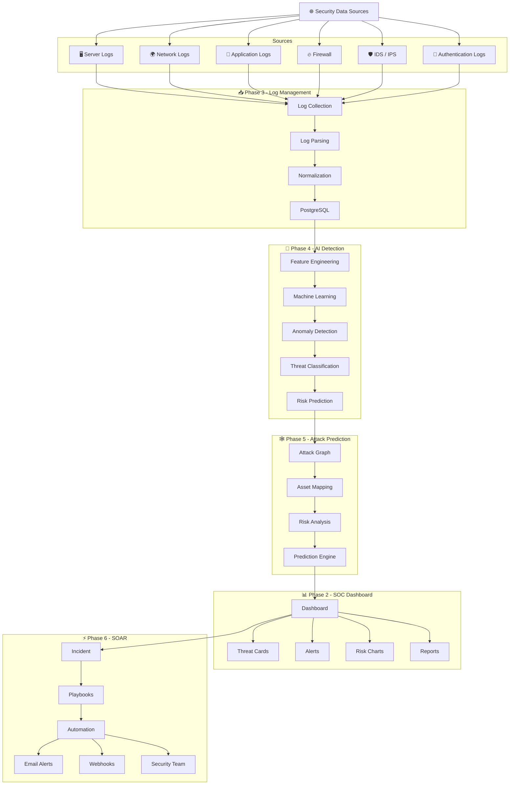
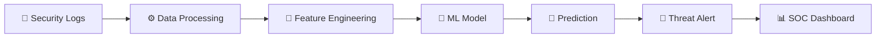
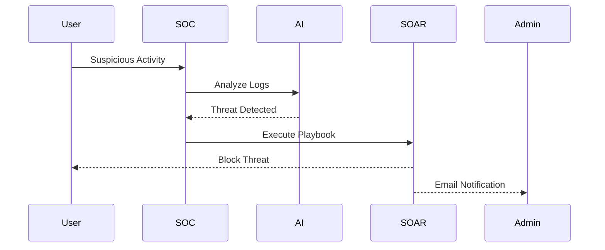

````markdown
<p align="center">

# 🛡️ AI Cyber Threat Intelligence System


</p>

<p align="center">


</p>

---

# 📖 Overview

AI Cyber Threat Intelligence System is an AI-powered Security Operations Center (SOC) platform that collects logs, detects cyber threats using Machine Learning, predicts attack paths, and automates incident response using SOAR.

---

# 🏗 Complete System Architecture



---

# 🤖 AI Threat Detection Workflow



---

# ⚡ Incident Response Workflow



---

# 🛠 Technology Stack

| Layer | Technologies |
|--------|--------------|
| 🎨 Frontend | React, Vite |
| ⚙ Backend | Python, FastAPI |
| 🗄 Database | PostgreSQL |
| 🤖 AI | Scikit-learn, Pandas, NumPy |
| 📊 Charts | Chart.js |
| 🔐 Security | JWT Authentication |
| 🐳 DevOps | Docker |

---

# 📂 Project Structure

```text
AI-Cyber-Threat-Intelligence-System
│
├── frontend
├── backend
├── ai-engine
├── dashboard
├── log-management
├── attack-prediction
├── soar
├── database
├── docker
├── docs
├── tests
└── README.md
```

---

# 🚀 Future Improvements

- 🛰 MITRE ATT&CK Mapping
- 🌐 Threat Intelligence API
- ☁ Cloud Monitoring
- 🤖 Deep Learning Detection
- 📱 Mobile SOC Dashboard
- 🔥 Real-Time Threat Feed
- 🛡 Zero Trust Integration

---

# ⭐ Support

If you like this project, don't forget to ⭐ Star the repository.

<p align="center">

## 🛡️ Predict • Detect • Respond • Secure

</p>
````
