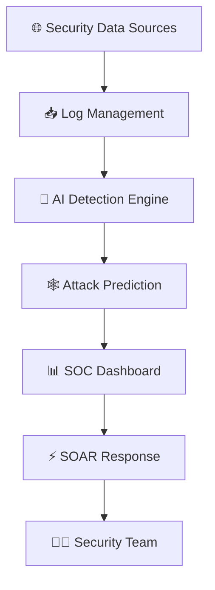
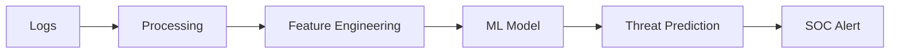
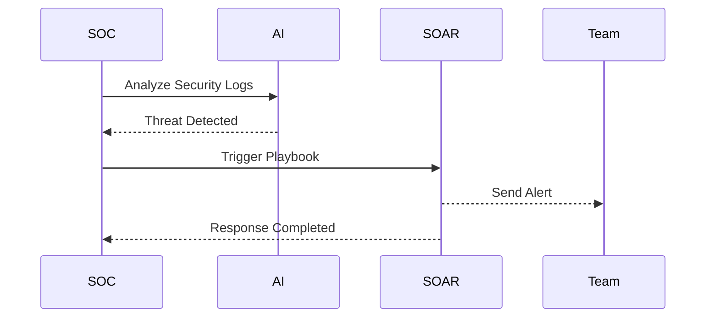

# 🛡️ AI Cyber Threat Intelligence System

<p align="center">
  
</p>

<p align="center">
  
  
  
  
  
</p>

---

## 📖 Overview

AI Cyber Threat Intelligence System is an AI-powered cybersecurity platform designed for Security Operations Centers (SOC) to collect security data, detect threats, predict attack paths, and automate incident response.

---

## 🏗️ System Architecture



---

## 🤖 AI Threat Detection Flow



---

## ⚡ Incident Response Workflow



---

## 🚀 Development Phases

| Phase | Module | Status |
|------|--------|--------|
| 1 | Project Foundation | ✅ |
| 2 | SOC Dashboard | 🔄 |
| 3 | Log Management | 🔄 |
| 4 | AI Detection | 🔄 |
| 5 | Attack Prediction | 🔄 |
| 6 | SOAR Automation | 🔄 |

---

## 🛠️ Technology Stack

| Layer | Technologies |
|------|--------------|
| Frontend | React, Vite |
| Backend | Python, FastAPI |
| Database | PostgreSQL |
| AI/ML | Scikit-learn, Pandas, NumPy |
| Security | JWT Authentication |
| DevOps | Docker |

---

## 📂 Project Structure

```text
AI-Cyber-Threat-Intelligence-System/
│
├── frontend/
├── backend/
├── ai-engine/
├── dashboard/
├── log-management/
├── attack-prediction/
├── soar/
├── database/
├── docker/
├── docs/
├── tests/
└── README.md
```

---

## 🔥 Key Features

- 📥 Log Ingestion & Parsing
- 🤖 AI Threat Detection
- 🕸️ Attack Path Prediction
- 📊 SOC Monitoring Dashboard
- ⚡ SOAR Automated Response
- 📧 Email & Webhook Notifications
- 🔐 Role-Based Access Control
- 📈 Risk Score Analytics

---

## ⭐ Support

If you like this project, give it a ⭐ on GitHub.

<p align="center">
  <b>🛡️ Predict • Detect • Respond • Secure</b>
</p>
